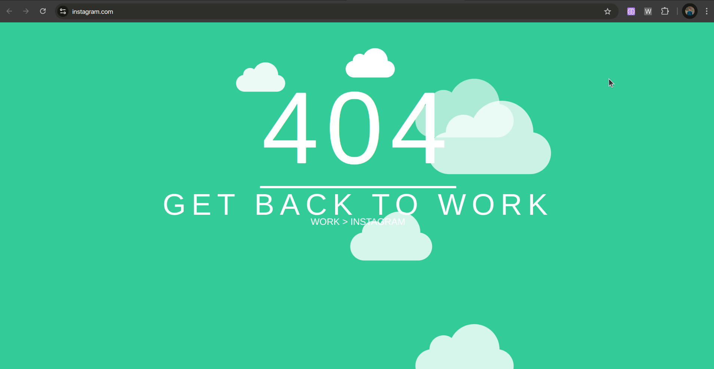
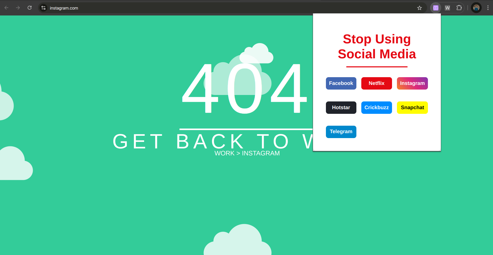
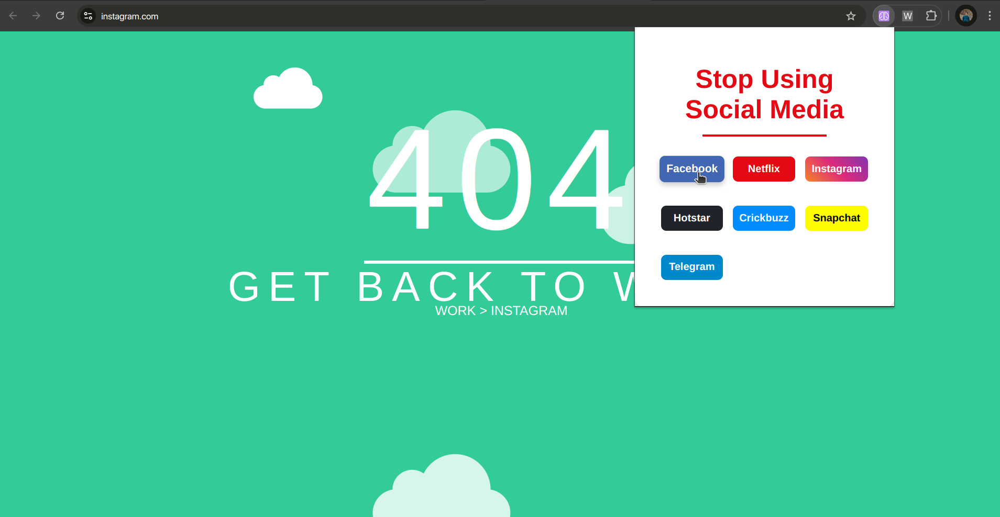

# Productivity Booster: Social Media Blocker Extension

## Overview
The **Productivity Booster** extension is designed to help you stay focused by blocking access to social media platforms like Instagram, Facebook, Netflix, and more. With a simple yet powerful UI, this extension ensures that distractions are kept at bay, allowing you to boost productivity and maintain focus on important tasks.

## Features

- **Interactive UI**: An interctive UI design is made.
- **Blocks Social Media Websites:** Automatically blocks access to popular social media platforms, including Instagram, Facebook, Netflix, and others, to reduce distractions.
- **Simple Operation:** Once installed, the extension works automatically, allowing you to stay focused without needing to tweak settings.
- **User-Friendly Interface:** A clean, intuitive, and easy-to-use interface for managing blocked sites.

## Technologies Used

- **HTML**: For creating the extension popup.
- **CSS**: For styling the extension interface.
- **JavaScript**: For functionality such as detecting YouTube video pages, capturing timestamps, and managing bookmarks.

## Installation

1. Clone this repository or download it as a ZIP file:
   ```bash
   git clone https://github.com/Dev2139/SocialMedia-Blocker-Extension.git
   ```

2. Open Google Chrome and navigate to `chrome://extensions/`.

3. Enable **Developer Mode** in the top-right corner.

4. Click **Load unpacked** and select the folder containing the extension files.

5. The extension will now be added to Chrome, and its icon will appear in the extensions bar.
  (I made a file Explaination.md in which I explained detail that how to deploy an extension to chrome web store)

## How it Works

- Once installed, the Productivity Booster extension will automatically block access to websites on the list. It works by intercepting requests to social media sites and redirecting them to a "blocked" page.

- Blocking Logic: The extension uses background scripts to check the URLs of any page you attempt to visit. If the site matches a blocked social media website, access is denied, and you’re redirected to a page indicating that the site is blocked.

- Managing Blocked Sites: You can manage the list of blocked sites directly through the extension’s settings popup.

# Usage

1.See Blocked Websites List: The popup also displays all the websites currently blocked.

2.Increases Productivity.

## Screenshots




5. ## Working Explaination

[](Proof/Working.mp4)

<!-- ## Linkedin Post Link
https://www.linkedin.com/posts/dev-patel2139_chromeextension-youtubebookmarks-codingproject-activity-7280175363962331136-bxge?utm_source=share&utm_medium=member_desktop -->


## Contributing

Contributions are welcome! Feel free to open an issue or submit a pull request.

---

Made with ❤️ to enhance your YouTube experience!
